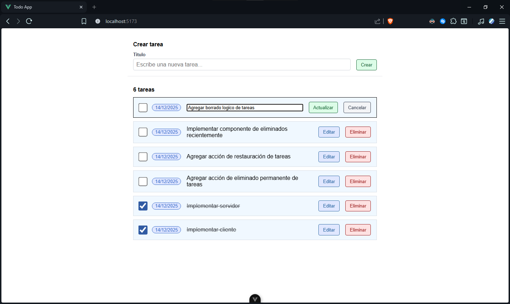

# TODOAPP





## Dependencias

- **Node.js** 
- **npm** 

## Instalación

1. Clonar el repositorio

```bash
git clone https://github.com/diegovazquezr/todoapp.git
cd todoapp
```
2. Instalar dependencias del servidor

```bash
cd server
npm install
``` 

3. Instalar dependencias del cliente

```bash
cd ../client 
npm install
``` 

## Ejecución

1. Iniciar servidor

```bash
cd ../server
node server.js
```

2. Iniciar cliente

```bash
cd ../client
npm run dev 
```

El cliente se ejecuta en: http://localhost:5173/

## Endpoints

| Método | Endpoint              | Descripción               |
| ------ | --------------------- | ------------------------- |
| GET    | `/tareas`             | Obtener tareas            |
| POST   | `/tareas`             | Crear tarea               |
| PUT    | `/tareas/:id`         | Actualizar tarea          |
| DELETE | `/tareas/:id`         | Eliminar tarea            |
